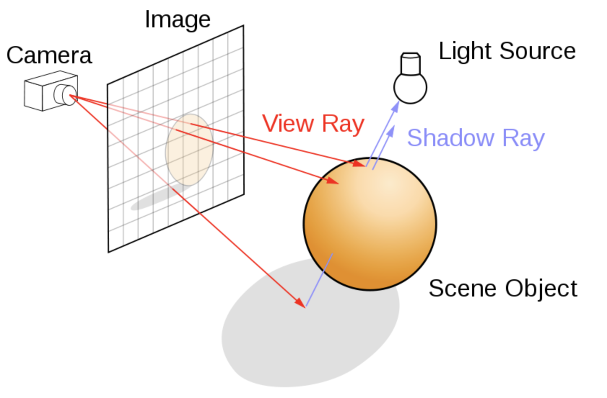

# Ray Tracer #

## Overview ##
In this assignment, you will be building a ray tracer. Your ray tracer will be able to handle opaque surfaces with lighting and shadows. Provided for you will be starter code that will load scene data from a file.

## Steps ## 
Step 1: Uniformly send out rays from the camera location. Since the camera does not have to move, you can assume that its location is (0,0,0). You should use backwards ray tracing where rays are sent from the camera, one ray per pixel. The final images should be 640x480, but for debugging you should use smaller resolutions with faster rendering times. For example, if you halve each dimension, you would send out 1/4th of the number of rays. You can use the field of view of 60 degrees.

Step 2: Write the intersection code. The mathematical solutions for the intersection code are provided in the lecture notes.

Step 3: Implement the illumination equations (provided below).

Step 4: Create still images showing off your ray tracer.

The source code gives you two methods of plotting a pixel. You can either only plot to the screen, or both to the screen and a JPEG file. You control this behavior by providing the second command line argument to your program. When the second argument is provided, output is generated both to screen and the filename given by the second argument. If you do not provide a second argument, plotting will be to screen only.

## Illumination ## 
At each intersection point, you need to first determine if it is in shadow, separately for each light source. You do this by launching a shadow ray to each of the lights. If the point is in shadow, its color with respect to that light should be (0,0,0), that is, black. If the point is not in shadow, use Phong shading to determine the color of the point with respect to that light:

I = lightColor * (kd * (L dot N) + ks * (R dot V) ^ sh)       (for each color channel separately; note that if L dot N < 0, you should clamp L dot N to zero; same for R dot V)

The final color of the point is the sum of the contributions from all lights, plus the global ambient color. You only add the global ambient color once, regardless of how many lights the scene has, and regardless of how many lights are visible from the point. Note that it could happen that a point is in shadow with respect to all lights. In this case, the final color will be the global ambient color. Or a point could be in shadow with respect to some lights, but not others. Or, all lights may be visible from a point. If the final color is greater than 1.0, you should of course clamp it to 1.0.

In order to compute I, you must determine the normal N at the intersection point. For triangles, you should interpolate the x,y,z coordinates of the normals given at each vertex, and then normalize the length. Use barycentric coordinates for interpolation of triangles. You should interpolate not just the normals, but also diffuse, specular and shininess coefficients. For spheres, the normal is simple to calculate based on the center of the sphere and the point location.

Background color: You can choose any suitable color as your background color. For example, choosing the white color (floating point (1.0, 1.0, 1.0), char (255, 255, 255)) is one good option.

## Functionality Requirements ##
This is the list of requirements for this assignment:

Triangle intersection (20 points)
Sphere intersection (20 points)
Triangle Phong shading (15 points)
Sphere Phong shading (15 points)
Shadows rays (15 points)
Still images (15 points)
Extra credit (up to 20 points max)

Recursive reflection (10 points)
Good antialiasing (10 points)
Soft shadows (10 points)
Animation (5 points)
Animation + Motion blur (15 points)
For recursive reflection, you need to call your ray tracer recursively. Of course, you still need to fire the shadow rays and compute a local Phong color, exactly as in non-recursive ray tracing described above. The final color should equal (1 - ks) * localPhongColor + ks * colorOfReflectedRay.

## FAQ ##
FAQ
1. Why do my spheres look somewhat squashed (like an "egg") ?
To some degree, spheres will look like eggs (ellipsoids), when they are not centered on the screen. This is due to perspective distortion and is normal and to be expected. However, the distortion should not be severe. See the example solution with the five spheres on the assignment webpage: you can see that the two outermost spheres are slightly ellipsoidal in the resulting 2D image. Compare their shape to the shape of the center sphere (which looks like a circle). These are correct results.. some amount of ellipsoidal distortion is normal.

That said, squashing can occur also if the aspect ratio is set incorrectly, or if the four corners of the image plane were not computed correctly, or if the rays were generated incorrectly. These would be wrong results.

Note that the tan function in math.h takes RADIANS as argument, not degrees.

/* tan example */
#include <stdio.h>
#include <math.h>

#define PI 3.14159265

int main ()
{
  double param, result;
  param = 45.0;
  result = tan (param*PI/180);
  printf ("The tangent of %lf degrees is %lf.\n", param, result );
  return 0;
}
2. Which normals to use for ray-triangle intersection?
The scene file provides a normal for every triangle vertex. However, those normals should NOT be used for ray-triangle intersection. For the intersection calculation, you need to compute the normal of the plane containing the triangle. You do so by taking a cross product of two edges:

A
 |\
 | \
 |  \
 -----
B     C
normal for ray-plane intersection = (B-A)x(C-A) (and you must normalize this vector)

The vertex normals provided in the scene file must be used for Phong shading, i.e., when evaluating I = lightColor * (kd * (L dot N) + ks * (R dot V) ^ sh) . You must interpolate the vertex normals given in the scene file to the specific location of the ray-triangle intersection (using barycentric coordinates). You then use the resulting interpolated normal N in the above equation (also to compute R). This will give smooth specular highlights.

3. If L dot N, or R dot V are negative, should I clamp them to zero?
If the angle between the view vector (V) and the reflected vector (R) is greater than 90 degrees, R dot V will be negative. In this case, the deviation between the reflection direction and the view direction is huge, i.e., we are very far from that case where the reflected and view direction nearly align and where we get specular highlights. So, there is no specular reflection in this case, and we can just clamp R dot V to zero.

Similarly for the diffuse component. If L dot N < 0, the light is below the horizon, so we clamp L dot N to 0.

4. How do I implement rendering in this homework without the OpenGL pipeline program? Do we write our own shaders? How do I set up my VBOs/VAOs? How do I write my vertex shader / fragment shader?
In this homework, we do not use OpenGL or the graphics pipeline. Instead, the entire ray tracing is performed on the CPU. The OpenGL code in the starter code is only for displaying your results on the screen. You should not be writing any GLSL shaders or OpenGL pipeline programs in this homework. You should also not be setting up any VBOs/VAOs, or writing any other OpenGL code.
